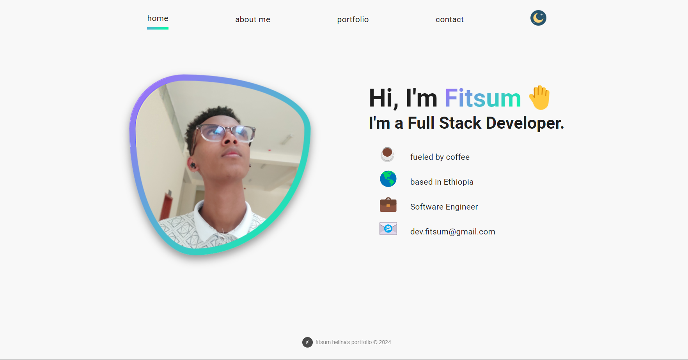

# My Portfolio Website

Welcome to my portfolio website! This website showcases my projects, skills, and contact information. It is built using React and is deployed on Vercel.

 <!-- Add a screenshot of your website here -->

## Table of Contents

- [Features](#features)
- [Installation](#installation)
- [Usage](#usage)
- [Deployment](#deployment)
- [Contributing](#contributing)
- [License](#license)
- [Contact](#contact)

## Features

- **Single Page Application**: Smooth navigation with React.
- **Responsive Design**: Works on all devices, including mobile phones.
- **Dynamic Content**: Easy to update content through structured data files.
- **Contact Form**: Allows visitors to send you a message directly from the website.

## Installation

To run this project locally, follow these steps:

1. Clone the repository:

    ```bash
    git clone https://github.com/yourusername/portfolio-website.git
    cd portfolio-website
    ```

2. Install the dependencies:

    ```bash
    npm install
    ```


3. Start the development server:

    ```bash
    npm start
    ```

4. Open your browser and navigate to `http://localhost:3000`.

## Usage

This portfolio website consists of various sections:

- **Home**: A brief introduction and profile picture.
- **About**: Information about me and my skills.
- **portfolio**: Showcase of my projects with links to live demos and source code.
- **Contact**: A form for visitors to send me a message.

## Deployment

The website is deployed on Vercel. To deploy your own version:

1. Sign up for a Vercel account if you don't have one.
2. Install the Vercel CLI:

    ```bash
    npm install -g vercel
    ```

3. Run the following command to deploy:

    ```bash
    vercel
    ```

Follow the prompts to complete the deployment process. Your website will be live on your chosen Vercel domain.

## Contributing

Contributions are welcome! If you would like to contribute to this project, please follow these steps:

1. Fork the repository.
2. Create a new branch:

    ```bash
    git checkout -b feature/your-feature-name
    ```

3. Make your changes.
4. Commit your changes:

    ```bash
    git commit -m 'Add some feature'
    ```

5. Push to the branch:

    ```bash
    git push origin feature/your-feature-name
    ```

6. Open a pull request.

Please ensure your code adheres to the project's coding standards and includes proper documentation.

## License

This project is licensed under the MIT License. See the [LICENSE](./LICENSE) file for details.

## Contact


<p >
  
</p>

You can find me on the following platforms:
- **Email**: dev.fitsum@gmail.com
- **LinkedIn**: [Fitsum Helina](https://www.linkedin.com/in/fitsum-helina-57164828a/)
- **Whatsapp**: [Fitsum Helina](https://wa.me/251904377900)

Feel free to reach out if you have any questions or want to connect!

---

**Maintainer**: Fitsum Helina

